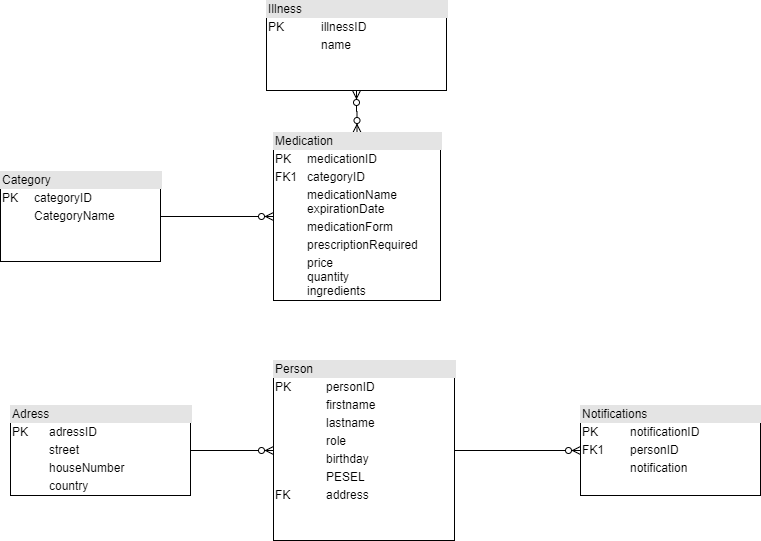

### Dokumentacja na pierwszy milestone spotkanie 01.12

#### Uruchomienie projektu
Komenda do uruchomienia projektu
```
gradle build
```

#### Model danych



#### Wzorce projektowe

Postanowiliśmy użyć wzorca obiektowego Data Access Object (DAO). 
Naszym plikiem DAO dla Person jest [HRDepartment](src/main/java/pl.edu.agh.to.drugstore/model/business/HRDepartment),
dla Medication jest [Magazine](src/main/java/pl.edu.agh.to.drugstore/model/business/Magazine)

#### Kto co wykonał w tym millestonie

| Wiktor | Przemysław | Paweł | Radosław|
|:-------|:-----------|:------|:--------|
| Konfiugracja Hibernate|  | Stworzenie początkowych klas modeli| Stworzenie prostego interfejsu terminalowego|
|        |              |           |Stworzenie prymitywnych metod wyszukujących adresy i użytkowników|
|           |           |           | Stworzenie schematu UML bazy danych|
|           |           |           | Podstawy dokumentacji |

#### Plan na kolejny sprint 

<ul>
    Skorzystania z wzorca composite przy wyszukiwaniu danych z bazy
</ul>
<ul>
    Konfiguracja interfejsu UI
</ul>
<ul>
    Stworzenie i poprawne działanie systemu powiadomień
</ul>
<ul>
    Implementacja pozostałych elementów modelu danych
</ul>
<ul>
    Obsługa logowania i autoryzacji działań w interfejsie użytkownika
</ul>
<ul>
    Dodanie testów do już zaimplementowanego kodu w celu zapewnienie poprawności działania
</ul>
<ul>
    Użycie Heroku DB jako bazy danych PostgresSQL
</ul>


#### Zrzuty z obecnego etapu rozwoju aplikacji